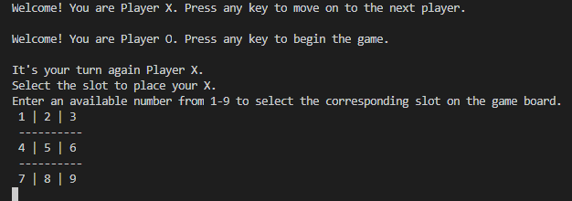
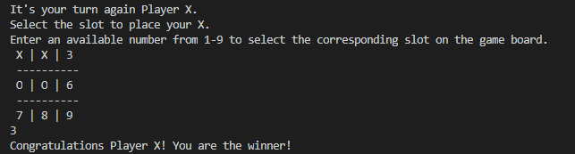

# Tic-Tac-Toe

> For this project, we made a traditional Tic-Tac-Toe using Ruby. 

# Instructions

A player has to select an available slot each turn, if the player selects 3 slots in 1 row, column or diagonal then that player wins. If the game ends without any winner the game is drawn.

# Setup

To run this code you can visit the [live preview](https://repl.it/@alexisbec/Tic-Tac-Toe), or you can install Ruby in your computer, clone this repository and run the main file in your terminal.

The start of the game: 

The winner:

## Built With

- Ruby

## Live Demo

[Live Demo Link](https://repl.it/@alexisbec/Tic-Tac-Toe)

## Author

👤 **Tasheka Hamilton**

- GitHub: [@alexisbec](https://github.com/Tasheka/)
- LinkedIn: [LinkedIn](https://www.linkedin.com/in/tasheka-hamilton-43532311b)

👤 **Alexis Varela**

- GitHub: [@alexisbec](https://github.com/alexisbec)
- LinkedIn: [LinkedIn](https://www.linkedin.com/in/alexis-varela-2584111b7/)

## 🤝 Contributing

Contributions, issues, and feature requests are welcome.

Feel free to check the [issues page](https://github.com/Tasheka/Tic-Tac-Toe/issues).

## Show your support

Give a ⭐️ if you like this project!

## 📝 License

This project is [MIT](https://github.com/Tasheka/Tic-Tac-Toe/blob/readme_game_instructions/LICENSE) licensed.